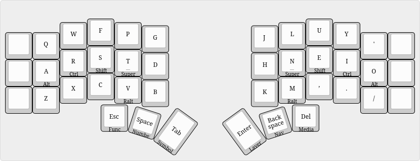
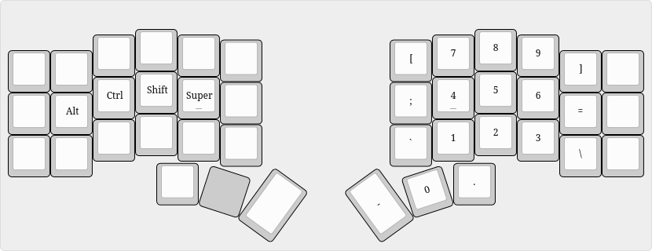
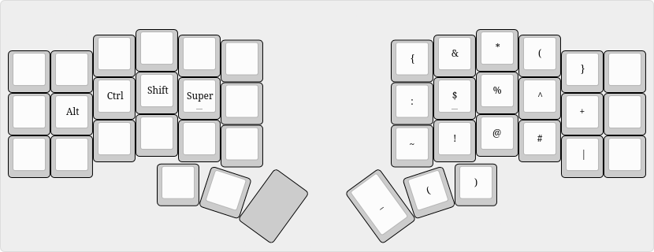
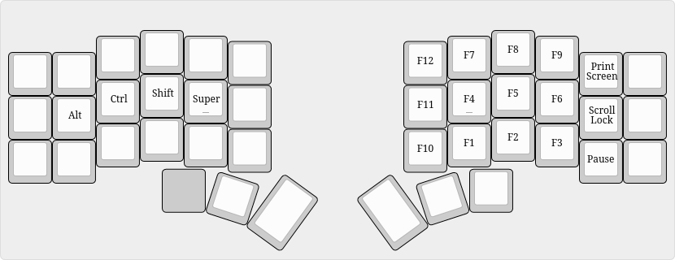
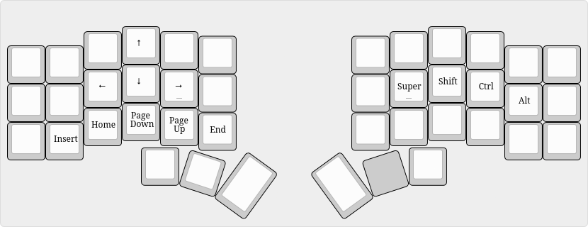
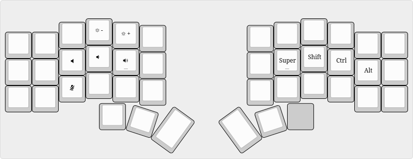
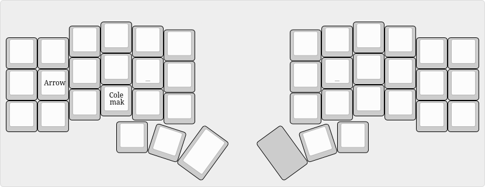
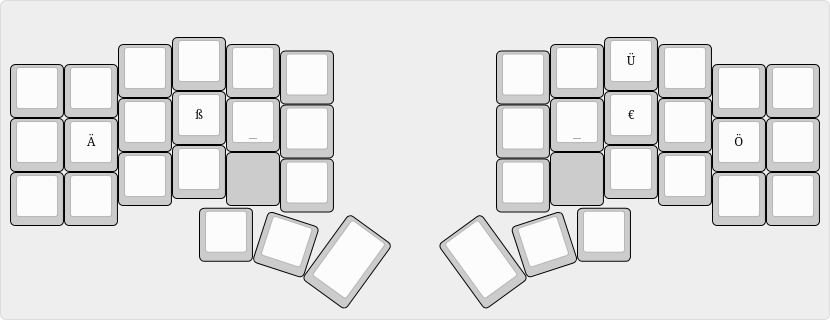
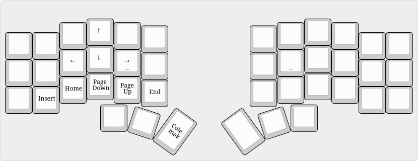

# Corne keymaps

My custom keymaps which is heavily inspired by [Miryoku](https://github.com/manna-harbour/miryoku).
Some differences are:

- Number, Symbol, and Function layer are right-hand layers
- arrows are above `WASD`
- modifier order is `Alt`, `Ctrl`, `Shift`, `Super`

## Installation

### Compile

Set up [QMK](https://docs.qmk.fm/newbs_getting_started).
This repository is a [QMK userspace](https://docs.qmk.fm/feature_userspace).
From the repository root run

```sh
qmk userspace-compile
```

This reads [`qmk.json`](qmk.json) and builds every target.
The resulting `.uf2` files are written to the repository root.

### Flash

The Aurora uses the same firmware for both halves.
The Halcyon halves each run their own firmware, so the two halves get different images.

Enter the bootloader, then copy the appropriate `.uf2` onto the drive that appears.

## Features

- [Miryoku](https://github.com/manna-harbour/miryoku) based
- [home row mods](https://precondition.github.io/home-row-mods)
- [mod-tap](https://docs.qmk.fm/mod_tap)
- [caps word](https://docs.qmk.fm/feature_caps_word)
- multiple layers with Colemak as base
- RALT layer for Umlaute, ß, €
- Halcyon rotary encoder
- Halcyon Cirque trackpad

## LAYERS

### Colemak

Base layer is Colemak with homerow mods.
`'` replaces `;` at the top right.
As I use a [tiling Wayland Compositor](https://hyprland.org),
my most used modifiers (`Shift`, `Super`) are on my strongest fingers.
`Ralt` is below the home row to be able to hold `hjkl` in vim.



### Number

Numbers are arranged like a numpad with symbols in the remaining positions.



### Symbol

Symbols are in the same location as shifted numbers.



### Function

`F1` to `F9` are arranged as the number layer with `F10` to `F12` to the left and system keys on the right.



### Navigation

Arrow keys at the same location as `WASD` with navigation keys below.



### Media

This layer includes brightness and volume control.
The `micmute` key sends `Super` + `/` which is configured to toggle the microphone
in my Wayland Compositor.



### Layer

Switch default layer to the selected.
Locations are mnemonic:

- `A` for `Arrow`
- `C` for `Colemak`
- `Q` for `QWERTY`



### Ralt

Custom Right-Alt layer for german letters and €-Symbol. Assumes US-International keyboard.



### Arrow

Dedicated arrow layer above `WASD`.


